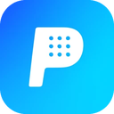
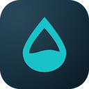

<h1 align="center">Hi 👋, I'm Alejandro</h1>
<h3 align="center">A passionate Software Engineer from Mexico</h3>


- 🤝 **Open to collaborations**: I'm building [Alchemist Coder](https://github.com/Alekla0126/alchemist-coder) in the open, and contributors are welcome

- ⚗️ [The Alchemist Code](https://thealchemistcode.org): apps and AI for your business

- 📱 **16 mobile apps** on the [App Store](https://apps.apple.com/us/developer/yabin-alejandro-lagunes-cuevas/id1754517101) and [Google Play](https://play.google.com/store/apps/developer?id=Alejandro+Lagunes)

- 👨‍💻 [My website is alekla.com](https://alekla.com)

- ♟️ [Chess clock built with Flutter and CD/CI](https://alekla0126.github.io/#/)

- 🎮 [Play some Tetris, made with Flutter and CD/CI](https://alekla0126.github.io/tetris/#/)

- 💬 Ask me about **Python, Flutter, C++**

- ⚡ **I like coffee and ETH (0x9742ebed977b0c03816d6db0ab52a5b39ed76def)**

---

<h3 align="left">⚗️ Alchemist Coder: the open-source lab for your coding agents</h3>

Claude Code, Codex, Gemini CLI and Grok in one desktop app, with your whole history kept and searchable. Follow every agent and subagent live, let several agents solve the same task in separate git worktrees and merge the best one, and run them on local models too (Ollama, LM Studio). Free, open source (AGPL-3.0), no account needed. macOS, Windows and Linux, in 11 languages.

<p align="left">
  <a href="https://coder.alekla.com">
    
  </a>
  <a href="https://github.com/Alekla0126/alchemist-coder">
    
  </a>
  <a href="https://github.com/Alekla0126/alchemist-coder/releases/latest">
    
  </a>
  <a href="https://github.com/Alekla0126/alchemist-coder/blob/main/CONTRIBUTING.md">
    
  </a>
  
</p>

<a href="https://coder.alekla.com"></a>

**Want to collaborate?** It's early (v1.x), so every bit of help shows:

- ⭐ **Try it and tell me what breaks:** [download it](https://coder.alekla.com/#download) and [open an issue](https://github.com/Alekla0126/alchemist-coder/issues/new) with bugs or ideas.
- 🔧 **Send a pull request:** start with [CONTRIBUTING.md](https://github.com/Alekla0126/alchemist-coder/blob/main/CONTRIBUTING.md). For anything bigger than a small fix, open an issue first so we agree on the approach.
- 🌍 **Improve a translation:** the app ships in 11 languages, and native speakers catch what I can't.
- 💬 Issues in English or Spanish are welcome. / ¿Hablas español? La app también está en español: [coder.alekla.com/es](https://coder.alekla.com/es)

---

<h3 align="left">📱 My apps on the App Store and Google Play</h3>

16 mobile apps for sports, productivity, AI and everyday life, made at [The Alchemist Code](https://thealchemistcode.org). See them all in one place:

<p align="left">
  <a href="https://apps.apple.com/us/developer/yabin-alejandro-lagunes-cuevas/id1754517101"></a>
  &nbsp;
  <a href="https://play.google.com/store/apps/developer?id=Alejandro+Lagunes"></a>
</p>

<table>
    <tr>
      <td width="64"></td>
      <td><b>Soccer24</b><br/>Live football scores, fixtures and tables from more than 1,100 competitions.</td>
      <td><a href="https://apps.apple.com/app/id6737065907"></a> <a href="https://play.google.com/store/apps/details?id=com.alekla0126.soccer24&amp;referrer=utm_source%3Dgithub%26utm_medium%3Dprofile%26utm_campaign%3Dreadme"></a></td>
    </tr>
    <tr>
      <td width="64"></td>
      <td><b>Clutch</b><br/>Live basketball scores, alerts for close finishes and a spoiler-free mode.</td>
      <td><a href="https://apps.apple.com/app/id6816774950"></a> <a href="https://play.google.com/store/apps/details?id=com.alchemistcode.clutch&amp;referrer=utm_source%3Dgithub%26utm_medium%3Dprofile%26utm_campaign%3Dreadme"></a></td>
    </tr>
    <tr>
      <td width="64"></td>
      <td><b>Padel Mate</b><br/>A padel scoreboard with real rules, your match history and your progress.</td>
      <td><a href="https://apps.apple.com/app/id6743674715"></a> <a href="https://play.google.com/store/apps/details?id=com.alekla0126.padelmate&amp;referrer=utm_source%3Dgithub%26utm_medium%3Dprofile%26utm_campaign%3Dreadme"></a></td>
    </tr>
    <tr>
      <td width="64"></td>
      <td><b>Instanotes AI</b><br/>A rich-text notepad where AI improves, shortens, translates or continues your writing.</td>
      <td><a href="https://apps.apple.com/app/id6775073535"></a> <a href="https://play.google.com/store/apps/details?id=com.alekla0126.scribeai&amp;referrer=utm_source%3Dgithub%26utm_medium%3Dprofile%26utm_campaign%3Dreadme"></a></td>
    </tr>
    <tr>
      <td width="64"></td>
      <td><b>PDF Master</b><br/>Scan documents, run OCR, sign and share PDFs without uploading anything to the cloud.</td>
      <td><a href="https://apps.apple.com/app/id6761705970"></a> <a href="https://play.google.com/store/apps/details?id=com.alekla.pdfmastermobile&amp;referrer=utm_source%3Dgithub%26utm_medium%3Dprofile%26utm_campaign%3Dreadme"></a></td>
    </tr>
    <tr>
      <td width="64"></td>
      <td><b>Komodo VPN</b><br/>One-tap VPN that encrypts your connection on public Wi-Fi.</td>
      <td><a href="https://apps.apple.com/app/id6569245786"></a> <a href="https://play.google.com/store/apps/details?id=com.alekla0126.vpn&amp;referrer=utm_source%3Dgithub%26utm_medium%3Dprofile%26utm_campaign%3Dreadme"></a></td>
    </tr>
    <tr>
      <td width="64"></td>
      <td><b>CalTracker AI</b><br/>Snap your meal and get calories, protein, carbs and fat in seconds.</td>
      <td><a href="https://apps.apple.com/app/id6803961821"></a> <a href="https://play.google.com/store/apps/details?id=com.thealchemistcode.caltracker_ai&amp;referrer=utm_source%3Dgithub%26utm_medium%3Dprofile%26utm_campaign%3Dreadme"></a></td>
    </tr>
</table>

<details>
<summary><b>9 more apps</b></summary>
<br/>

<table>
    <tr>
      <td width="64"></td>
      <td><b>PeakPlay NFL</b><br/>Live NFL scores, stats, schedules and news for all 32 teams.</td>
      <td><a href="https://play.google.com/store/apps/details?id=com.peakplay.nfl&amp;referrer=utm_source%3Dgithub%26utm_medium%3Dprofile%26utm_campaign%3Dreadme"></a></td>
    </tr>
    <tr>
      <td width="64"></td>
      <td><b>Padely</b><br/>Padel scorekeeper for iPhone and Apple Watch, with golden point and best-of-three sets.</td>
      <td><a href="https://apps.apple.com/app/id6661034757"></a></td>
    </tr>
    <tr>
      <td width="64"></td>
      <td><b>Walpy</b><br/>AI wallpapers made at your phone's exact resolution.</td>
      <td><a href="https://play.google.com/store/apps/details?id=com.alekla.Walpy&amp;referrer=utm_source%3Dgithub%26utm_medium%3Dprofile%26utm_campaign%3Dreadme"></a></td>
    </tr>
    <tr>
      <td width="64"></td>
      <td><b>Inventra</b><br/>Inventory, sales, purchases and low-stock alerts for small businesses, synced to the cloud.</td>
      <td><a href="https://play.google.com/store/apps/details?id=com.alekla.inventory.inventra_cross&amp;referrer=utm_source%3Dgithub%26utm_medium%3Dprofile%26utm_campaign%3Dreadme"></a></td>
    </tr>
    <tr>
      <td width="64"></td>
      <td><b>CleanPro</b><br/>Find duplicate photos and free up storage safely on Android.</td>
      <td><a href="https://play.google.com/store/apps/details?id=com.cleanpro.app&amp;referrer=utm_source%3Dgithub%26utm_medium%3Dprofile%26utm_campaign%3Dreadme"></a></td>
    </tr>
    <tr>
      <td width="64"></td>
      <td><b>Nerite</b><br/>Aquarium log, reef dosing calculator and maintenance reminders. Works offline.</td>
      <td><a href="https://play.google.com/store/apps/details?id=com.thealchemistcode.aquarium_manager&amp;referrer=utm_source%3Dgithub%26utm_medium%3Dprofile%26utm_campaign%3Dreadme"></a></td>
    </tr>
    <tr>
      <td width="64"></td>
      <td><b>MinoxTrack</b><br/>A private tracker and reminder for your minoxidil routine.</td>
      <td><a href="https://apps.apple.com/app/id6757134831"></a> <a href="https://play.google.com/store/apps/details?id=com.alekla0126.minoxtrack&amp;referrer=utm_source%3Dgithub%26utm_medium%3Dprofile%26utm_campaign%3Dreadme"></a></td>
    </tr>
    <tr>
      <td width="64"></td>
      <td><b>Jump Rope Coach</b><br/>Interval jump-rope workouts with voice and vibration cues.</td>
      <td><a href="https://play.google.com/store/apps/details?id=com.thealchemistcode.jumpropecoach&amp;referrer=utm_source%3Dgithub%26utm_medium%3Dprofile%26utm_campaign%3Dreadme"></a></td>
    </tr>
    <tr>
      <td width="64"></td>
      <td><b>Waterday</b><br/>Free daily watering reminders for every houseplant.</td>
      <td><a href="https://play.google.com/store/apps/details?id=com.thealchemistcode.waterday&amp;referrer=utm_source%3Dgithub%26utm_medium%3Dprofile%26utm_campaign%3Dreadme"></a></td>
    </tr>
</table>

</details>

---

<h3 align="left">🏛️ Stoic Phrase — Terminal tool</h3>

A CLI that greets you with a Stoic quote and its author every time you open a terminal. Colors included.

```bash
brew tap alekla0126/stoic-phrase https://github.com/Alekla0126/Stoic-Phrase
brew install stoic-phrase
```

> Dependencies (`jq`, `lolcat`) are installed automatically. On first run, the quote appears on every new terminal session.

<p align="left">
  <a href="https://github.com/Alekla0126/Stoic-Phrase">
    
  </a>
  
  
</p>

---

<h3 align="left">Connect with me:</h3>
<p align="left">
<a href="https://kaggle.com/alejandrolagunes" target="blank"></a>
</p>

<h3 align="left">Languages and Tools:</h3>
<p align="left"> <a href="https://developer.android.com" target="_blank" rel="noreferrer">  </a> <a href="https://www.arduino.cc/" target="_blank" rel="noreferrer">  </a> <a href="https://aws.amazon.com" target="_blank" rel="noreferrer">  </a> <a href="https://www.gnu.org/software/bash/" target="_blank" rel="noreferrer">  </a> <a href="https://www.w3schools.com/cpp/" target="_blank" rel="noreferrer">  </a> <a href="https://www.docker.com/" target="_blank" rel="noreferrer">  </a> <a href="https://www.figma.com/" target="_blank" rel="noreferrer">  </a> <a href="https://firebase.google.com/" target="_blank" rel="noreferrer">  </a> <a href="https://flask.palletsprojects.com/" target="_blank" rel="noreferrer">  </a> <a href="https://flutter.dev" target="_blank" rel="noreferrer">  </a> <a href="https://cloud.google.com" target="_blank" rel="noreferrer">  </a> <a href="https://git-scm.com/" target="_blank" rel="noreferrer">  </a> <a href="https://www.java.com" target="_blank" rel="noreferrer">  </a> <a href="https://laravel.com/" target="_blank" rel="noreferrer">  </a> <a href="https://www.linux.org/" target="_blank" rel="noreferrer">  </a> <a href="https://www.mysql.com/" target="_blank" rel="noreferrer">  </a> <a href="https://www.photoshop.com/en" target="_blank" rel="noreferrer">  </a> <a href="https://postman.com" target="_blank" rel="noreferrer">  </a> <a href="https://www.python.org" target="_blank" rel="noreferrer">  </a> <a href="https://reactjs.org/" target="_blank" rel="noreferrer">  </a> <a href="https://reactnative.dev/" target="_blank" rel="noreferrer">  </a> <a href="https://scikit-learn.org/" target="_blank" rel="noreferrer">  </a> <a href="https://developer.apple.com/swift/" target="_blank" rel="noreferrer">  </a> <a href="https://www.tensorflow.org" target="_blank" rel="noreferrer">  </a> <a href="https://vuejs.org/" target="_blank" rel="noreferrer">  </a> </p>

[comment]: <> (<p></p>)

[comment]: <> (<p>&nbsp;</p>)

